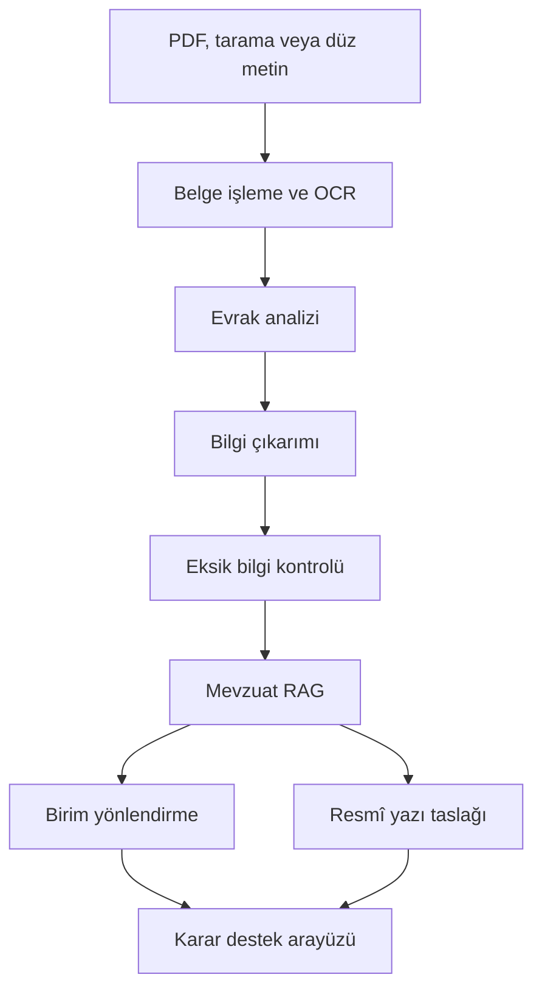

<div align="center">

# CoreAIgent

### Kamu Evrak ve Yazışma Süreçleri İçin Akıllı Agent Destek Sistemi

**YAZGIT LinguAI · TEKNOFEST 2026**

Türkçe doğal dil işleme, mevzuat tabanlı bilgi erişimi ve çok ajanlı sistemlerle  
kamu evraklarını analiz eden, doğrulayan, yönlendiren ve resmî yazı taslakları üreten karar destek platformu.


</div>

---

## Proje hakkında

Kamu kurumlarına ulaşan belgelerin manuel olarak okunması, sınıflandırılması, eksik bilgilerinin bulunması ve doğru birime yönlendirilmesi zaman alan, tekrarlı ve hata riski taşıyan işlemlerdir.

**CoreAIgent**, PDF, taranmış belge veya düz metin olarak alınan bir evrakı uçtan uca işleyerek kamu personeline açıklanabilir karar desteği sunmayı hedefler. Sistem yalnızca metin üretmez; ürettiği sonuçları yapılandırır, ilgili mevzuat kaynaklarıyla destekler ve kullanıcıya kontrol edilebilir bir çıktı sağlar.

> [!IMPORTANT]
> CoreAIgent bir karar destek sistemidir. Nihai kurumsal ve hukuki karar yetkili kullanıcıya aittir.

## Temel yetenekler

| Yetenek | Açıklama | Örnek çıktı |
| --- | --- | --- |
| Belge işleme | PDF, tarama ve düz metinden içerik çıkarma | Temizlenmiş belge metni |
| Evrak analizi | Belgenin türünü ve ana konusunu belirleme | Evrak sınıfı ve güven skoru |
| Bilgi çıkarımı | Kişi, kurum, tarih, konu, talep ve referansları bulma | Yapılandırılmış alanlar |
| Eksik bilgi tespiti | Zorunlu, şüpheli veya çelişkili alanları kontrol etme | Eksik bilgi listesi |
| Mevzuat RAG | İlgili mevzuat ve kurum dokümanlarında arama | Kaynak ve madde referansları |
| Birim yönlendirme | Evrakı uygun birim veya iş akışına yönlendirme | Birim önerisi ve gerekçesi |
| Resmî yazı taslağı | Cevap, üst yazı veya bilgilendirme taslağı hazırlama | Düzenlenebilir taslak |
| Karar desteği | Bütün çıktıları tek ekranda birleştirme | Açıklanabilir sonuç ekranı |

## Sistem akışı



## Mimari

Sistem, görevleri uzman bileşenlere dağıtan bir orkestrasyon katmanı etrafında tasarlanır.

| Katman | Bileşenler | Sorumluluk |
| --- | --- | --- |
| Girdi | Dosya yükleme, PDF ayrıştırma, OCR | Belgeyi güvenli ve işlenebilir metne dönüştürmek |
| Agent | Analiz, bilgi çıkarımı, doğrulama, RAG, yönlendirme, yazışma | Uzman görevleri bağımsız ve izlenebilir şekilde yürütmek |
| Orkestrasyon | CoreAIgent Orchestrator | Görev sırasını, hata yönetimini ve sonuç birleşimini yönetmek |
| Model | Jamba2-3B-Turkish ve görev modelleri | Türkçe dil anlama ve üretim yeteneklerini sağlamak |
| Bilgi | Mevzuat, yazışma kuralları, kurum dokümanları, örnek şablonlar | Kaynaklı ve kuruma uyarlanabilir bağlam sunmak |
| Uygulama | Backend API ve web arayüzü | Analiz sürecini kullanıcıya sunmak |
| Değerlendirme | Classifier, retrieval, RAG ve uçtan uca testler | Doğruluk, güvenilirlik ve performansı ölçmek |

### Agent bileşenleri

- **Evrak Analiz Agent:** Evrak türünü ve ana konuyu belirler.
- **Bilgi Çıkarım Agent:** Kritik alanları yapılandırılmış biçimde çıkarır.
- **Eksik Bilgi ve Doğrulama Agent:** Eksik, şüpheli veya çelişkili alanları işaretler.
- **RAG ve Mevzuat Agent:** İlgili kaynak parçalarını bulur ve referansları korur.
- **Yönlendirme Agent:** Uygun kurum birimi veya işlem akışını gerekçesiyle önerir.
- **Draft ve Yazışma Agent:** Resmî yazışma kurallarına uygun düzenlenebilir taslak üretir.

> [!NOTE]
> Her işlem agent olmak zorunda değildir. Belge ayrıştırma, şema doğrulama ve deterministik kontroller gerektiğinde normal servisler olarak uygulanır.

## Planlanan depo yapısı

Depo yapısı, mevcut kodlar birleştirilirken aşağıdaki hedefe göre düzenlenecektir:

```text
coreaigent/
├── apps/
│   ├── api/                     # Backend ve dış API katmanı
│   └── web/                     # Kullanıcı arayüzü
├── services/
│   ├── document_processing/     # PDF, OCR ve metin temizleme
│   ├── classifier/              # Evrak sınıflandırma
│   ├── information_extraction/  # Kritik bilgi çıkarımı
│   ├── validation/              # Eksik bilgi ve şema kontrolleri
│   ├── rag/                     # Embedding, retrieval ve mevzuat
│   └── agents/                  # Uzman agent bileşenleri
├── orchestrator/                # Agent iş akışı ve hata yönetimi
├── schemas/                     # Ortak veri ve JSON şemaları
├── prompts/                     # Versiyonlanmış sistem promptları
├── evaluation/                  # Model ve sistem değerlendirmeleri
├── tests/                       # Otomatik testler
├── scripts/                     # Veri ve geliştirme yardımcıları
├── sample_data/                 # Anonim ve küçük örnek veriler
└── docs/                        # Teknik dokümantasyon
```

## Kurulum ve çalıştırma

> [!WARNING]
> Mevcut bileşenler ortak depoda birleştirilme aşamasındadır. Doğrulanmamış kurulum komutları paylaşmamak için bu bölüm, ilk çalışan entegrasyon tamamlandıktan sonra güncellenecektir.

Kurulum dokümantasyonu tamamlandığında bu bölümde şunlar yer alacaktır:

1. Desteklenen Python ve Node.js sürümleri
2. Sistem bağımlılıkları ve OCR gereksinimleri
3. Sanal ortam ve paket kurulumu
4. `.env.example` üzerinden ortam değişkenleri
5. Model ve vektör veritabanı hazırlığı
6. Backend ve web arayüzünü başlatma komutları
7. Testleri çalıştırma adımları

## Yapılandırma ve gizli bilgiler

Gerekli ortam değişkenleri yalnızca `.env.example` dosyasında, örnek ve gizli olmayan değerlerle belgelenmelidir.

```bash
cp .env.example .env
```

Gerçek API anahtarları, erişim bilgileri ve parolalar hiçbir koşulda GitHub'a gönderilmemelidir.

## Veri güvenliği

- Gerçek kişisel veri içeren kamu evrakları depoya eklenmez.
- Geliştirme ve demo verileri anonimleştirilmiş veya sentetik olmalıdır.
- Ham ve hassas veri setleri erişimi sınırlandırılmış ortak depolama alanında tutulur.
- Büyük veri setleri ve model ağırlıkları Git ile sürümlenmez.
- Kaynak dokümanların adı, sürümü ve erişim tarihi veri envanterinde korunur.
- Log kayıtlarında belge içeriği ve kişisel veri tutulmaması tercih edilir.

## Değerlendirme yaklaşımı

| Bileşen | Temel değerlendirme |
| --- | --- |
| OCR | Karakter/kelime hata oranı ve örnek bazlı inceleme |
| Evrak classifier | Precision, recall, F1 ve confusion matrix |
| Bilgi çıkarımı | Alan bazlı precision, recall ve F1 |
| Retrieval | Recall@K, MRR, gecikme ve insan değerlendirmesi |
| RAG | Kaynak uyumu, doğruluk, eksiksizlik ve halüsinasyon kontrolü |
| Yönlendirme | Doğru birim oranı ve gerekçe kalitesi |
| Yazışma | Biçim, resmî dil, kaynak uyumu ve uzman incelemesi |
| Uçtan uca sistem | Başarı oranı, işlem süresi ve hata senaryoları |

## Geliştirme iş akışı

Ana branch'ler:

- `main`: Test edilmiş ve demo verilebilir sürüm
- `develop`: Entegre geliştirme sürümü
- `feature/<konu>`: Bağımsız geliştirme branch'leri
- `fix/<konu>`: Hata düzeltmeleri
- `docs/<konu>`: Dokümantasyon değişiklikleri

Örnek başlangıç:

```bash
git clone <REPOSITORY_URL>
cd coreaigent
git switch develop
git pull
git switch -c feature/rag-retrieval
```

Değişiklik tamamlandığında:

```bash
git add <degisen-dosyalar>
git commit -m "feat(rag): mevzuat retrieval servisini ekle"
git push -u origin feature/rag-retrieval
```

Ardından `develop` branch'ine Pull Request açılır. Doğrudan `main` branch'ine geliştirme gönderilmez.

### Commit biçimi

| Önek | Kullanım |
| --- | --- |
| `feat` | Yeni özellik |
| `fix` | Hata düzeltmesi |
| `docs` | Dokümantasyon |
| `test` | Test ekleme veya düzenleme |
| `refactor` | Davranışı değiştirmeyen kod düzenlemesi |
| `data` | Veri hazırlama veya şema değişikliği |
| `chore` | Bakım ve araç değişiklikleri |

Örnekler:

```text
feat(classifier): evrak türü tahmin endpointini ekle
fix(ocr): Türkçe karakter normalizasyonunu düzelt
test(rag): mevzuat retrieval değerlendirmesini ekle
docs(api): analiz endpointi kullanımını açıkla
```

## Pull Request kontrol listesi

Bir Pull Request açmadan önce:

- [ ] Kod yerel ortamda çalıştırıldı.
- [ ] İlgili testler eklendi veya güncellendi.
- [ ] Gizli bilgi ya da kişisel veri eklenmedi.
- [ ] Büyük model/veri dosyaları repoya gönderilmedi.
- [ ] Yeni yapılandırmalar `.env.example` içinde belgelendi.
- [ ] Görev bağlantısı PR açıklamasına eklendi.
- [ ] Beklenen çıktı ve test sonucu açıklandı.
- [ ] Gerekiyorsa README veya teknik dokümantasyon güncellendi.

## Proje yönetimi

| İçerik | Kullanılan alan |
| --- | --- |
| Kaynak kod ve sürüm kontrolü | GitHub |
| Görev, sorumlu, durum ve teslim takibi | ClickUp |
| Veri setleri, PDF'ler, sunumlar ve büyük dosyalar | Google Drive |
| Hızlı ekip iletişimi | WhatsApp |

Görev durumu ve teknik kararlar mesaj geçmişine bırakılmamalı; ilgili ClickUp görevi veya dokümanı üzerinde kayıt altına alınmalıdır.

## Yol haritası

- [ ] Mevcut kod, model ve veri envanterinin tamamlanması
- [ ] Minimum çalışan demo kapsamının kesinleştirilmesi
- [ ] Veri setlerinin temizlenmesi ve ayrılması
- [ ] PDF/OCR işlem hattının tamamlanması
- [ ] Sınıflandırma ve bilgi çıkarımının doğrulanması
- [ ] Embedding modeli ve vektör veritabanının seçilmesi
- [ ] Mevzuat RAG sisteminin değerlendirilmesi
- [ ] Uzman agent'ların ve Orchestrator'ın entegrasyonu
- [ ] Backend API ve kullanıcı arayüzünün birleştirilmesi
- [ ] Uçtan uca testlerin tamamlanması
- [ ] Demo provası ve yedek demo videosu
- [ ] Teknik dokümantasyon ve final teslimi

## Katkıda bulunanlar

Bu proje, **YAZGIT LinguAI** yarışma ekibi tarafından geliştirilmektedir. Güncel görev ve sorumluluk dağılımı ClickUp çalışma alanında tutulur.

## Kullanım ve lisans

Bu depo takım içi yarışma geliştirmesi içindir. Kaynak kodun, veri setlerinin, model çıktılarının veya dokümanların izinsiz kopyalanması, dağıtılması ya da yeniden kullanılması yasaktır.

Lisanslama kararı kesinleşene kadar depo içeriği açık kaynak kabul edilmez.

---

<div align="center">

**YAZGIT LinguAI CoreAIgent**  
Türkçe odaklı · Açıklanabilir · Modüler · Uygulanabilir

</div>
