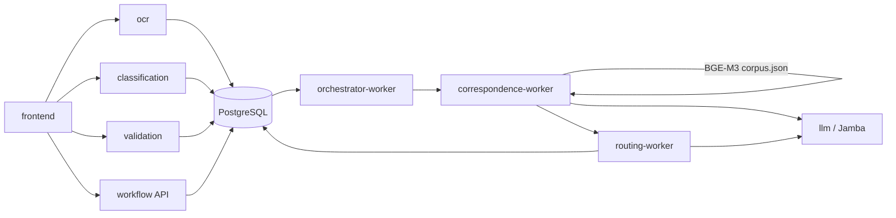

# Architecture

Read this when you need service boundaries, orchestration behaviour, or the
runtime modes. For paths use [`repository-map.md`](repository-map.md); for
payloads use [`contracts.md`](contracts.md); for the per-request sequence use
[`data-flow.md`](data-flow.md). Decision records live in
[`architecture/ARCHITECTURE.md`](architecture/ARCHITECTURE.md) and the
per-feature `architecture/ARCHITECTURE_*_f0N.md` sessions.

## Purpose

Turkish public-document (evrak) intake through official-correspondence drafting,
for the TEKNOFEST 1st scenario. The system takes petition or official-document
text, decides what it is, decides what is missing, retrieves the relevant local
regulation, drafts an official reply with a local LLM, routes it to a target
unit, and keeps a durable case projection an operator can poll.

## Service boundaries

Six logical HTTP services, fixed names and hostnames, all listening on `:8080`
inside the Compose network.

| Service | Owns | Real implementation |
| --- | --- | --- |
| `ocr` | intake, normalization, language decision, intake outbox | `services/ocr/` |
| `classification` | taxonomy scoring, current classification record | `services/classification/` |
| `validation` | field extraction, missing/invalid split, supplemental patch | `services/validation/` |
| `rag` | retrieval contract shape | mock only — real retrieval is inside `workflow` |
| `llm` | Jamba text generation | `services/llm/` |
| `workflow` | correspondence, routing, notifications, case projection | `services/workflow/` |

A service never reads another service's tables through its own code path; the
public boundary is the contract in `contracts/http/manifest.json`. The one
deliberate exception is shared PostgreSQL state: `validation` and `workflow`
project rows written by upstream services in the same database, which is why a
schema change in an upstream service is a cross-service change.

## Orchestration

Orchestration is **not** a single synchronous pipeline call. Two mechanisms
coexist:

- **Client-driven synchronous steps.** The caller (frontend or an acceptance
  runner) posts to `ocr`, then `classification`, then `validation`. Each call is
  request/response and each writes its own current record.
- **Durable server-side workers.** Once a validation revision is complete,
  `orchestrator-worker` creates the F-04 correspondence job on its own
  (one initial attempt plus at most three 30-second cooldown retries, see
  `services/workflow/orchestrator.py`). `correspondence-worker` performs
  retrieval and generation; its completion creates the routing job that
  `routing-worker` consumes. Jobs are leased rows in PostgreSQL, so a worker
  restart does not lose or duplicate work.

Case state is derived, never stored ad hoc: `derive_case_state()` in
`services/workflow/orchestrator.py` maps classification, completion,
generation, routing, and notification status to one of `needs_review`,
`extracting`, `waiting_for_user`, `ready_for_processing`, `draft_prepared`,
`notification_pending`, `failed`, `completed`.

## Persistence

PostgreSQL 16 (`postgres` service, defined in `compose.ocr.yaml`) is the only
durable store; there is no message broker and no cache tier. Each service
creates its own tables idempotently at startup/readiness (`ensure_schema()`),
so there is no migration tool. Every real overlay therefore transitively
requires `compose.ocr.yaml`.

The frontend keeps a browser-local index of recently opened case IDs
(`frontend/src/storage.ts`); that is convenience state, not a source of truth.

## Model boundary

Two local models, both pinned and loaded offline:

- **Jamba** (`ai21labs/AI21-Jamba2-3B`) is served only by the `llm` service.
  Business logic never imports a model library; it calls `POST /generate`.
- **BGE-M3** (`BAAI/bge-m3`) is loaded in-process by
  `services/workflow/worker.py` for dense retrieval and schema repair. It is not
  exposed as an HTTP service.

Model output is always constrained by deterministic server-side code: retrieval
selection, PII minimization, and draft guards live in
`services/workflow/correspondence.py`, and routing targets are chosen by
`services/workflow/routing.py`, never by the model.

## Runtime modes

```text
compose.yaml                  → six deterministic mocks + frontend (baseline)
+ compose.ocr.yaml            → real ocr + PostgreSQL
+ compose.classification.yaml  → real classification API + durable worker
+ compose.validation.yaml     → real validation (deterministic extractor)
+ compose.validation.jamba.yaml → validation uses the real Jamba extractor
+ compose.workflow.yaml       → real workflow API + 3 durable workers
+ compose.llm.yaml            → real Jamba on CUDA, in-container weights
| compose.llm.gguf.yaml       → real Jamba via host llama.cpp (Vulkan/Radeon)
+ compose.integration.yaml    → every service replaced by a SHA-pinned image
```

Overlays are additive and order-sensitive; `compose.llm.yaml` and
`compose.llm.gguf.yaml` are mutually exclusive. Verified closures are registered
in `scripts/local-topologies.json`. Commands:
[`development.md`](development.md).

## Diagram


