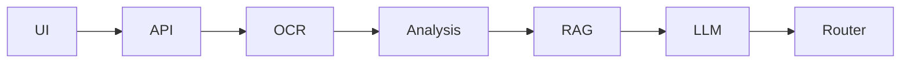

# Repository Context Documentation — AGENTS.md + Docs/

Bu repository için Claude Code ve diğer coding agent'ların **minimum token kullanarak projeyi doğru anlamasını sağlayacak bir context/documentation katmanı** oluştur.

Amaç yeni bir kapsamlı teknik dokümantasyon yazmak değil; repository içindeki kod, servis, contract ve mevcut dokümanlar arasındaki **anlamsal ilişkiyi indekslemek** ve bir coding agent'ın ihtiyacı olan bilgiye mümkün olan en kısa yoldan ulaşmasını sağlamaktır.

## Temel Hedef

Repository root'una:

`AGENTS.md`

oluştur.

Ayrıca:

`Docs/`

altında küçük ve konu bazlı `.md` dosyaları oluştur.

`AGENTS.md` bir "master documentation" olmamalıdır.

Bunun yerine şunları yapmalıdır:

- Projenin 10-20 satırlık genel tanımını vermek
- Ana klasörleri ve servisleri listelemek
- Her servis için ilgili `Docs/...` dosyasına referans vermek
- Contract/schema kaynaklarının gerçek dosya yollarını göstermek
- Bir agent'ın belirli bir görev için **hangi dosyaları önce okuması gerektiğini** belirtmek
- Aynı bilgiyi farklı dokümanlarda tekrar etmemek
- Detaylı açıklamaları `Docs/` altına yönlendirmek

Ana optimizasyon hedefi:

> Claude Code'un her görevde bütün repository'yi veya bütün dokümantasyonu tekrar okumak zorunda kalmaması.

---

# 1. Önce Repository'yi Analiz Et

Doküman oluşturmadan önce repository'yi incele.

Özellikle şunları tespit et:

- servisler
- uygulamalar
- frontend
- backend
- shared/common kodlar
- contracts
- JSON Schema dosyaları
- Docker / Compose
- tests
- E2E tests
- mock services
- model servisleri
- configuration
- dataset / evaluation yapısı
- mevcut Markdown dokümantasyonu
- deployment/run scriptleri

Gerçek repository yapısını esas al.

**Var olmayan dosya yolu, servis, endpoint veya contract uydurma.**

Bir bileşenin amacı koddan açıkça çıkarılamıyorsa:

`Purpose unclear from repository`

şeklinde belirt.

---

# 2. Proje Kapsamını Anla

Bu proje TEKNOFEST Türkçe Yapay Zeka Dil Ajanları Yarışması 1. Senaryo kapsamında geliştirilen:

**Kamu Evrak ve Yazışma Süreçleri için Akıllı Agent Destek Sistemi**

projesidir.

Temel sistem akışı yaklaşık olarak şunları kapsar:

```text
Document / Request
        ↓
OCR / Text Extraction
        ↓
Document Analysis
        ↓
Classification
        ↓
Information Extraction
        ↓
Missing Information Detection
        ↓
Legislation / Knowledge Retrieval
        ↓
LLM / Jamba Reasoning
        ↓
Official Draft Generation
        ↓
Department Routing
        ↓
Case / Ticket Result
        ↓
UI / API
```

Repository farklı isimler kullanıyorsa repository'deki gerçek isimleri kullan.

Bu listeyi repository'ye zorla uygulama.

---

# 3. AGENTS.md Oluştur

Root:

`/AGENTS.md`

Dosya mümkün olduğunca kısa tutulmalı.

Hedef yaklaşık:

**150-300 satırdan küçük olmasıdır.**

AGENTS.md aşağıdaki yapıyı kullansın.

---

## Project

Projenin 1-2 paragraflık teknik özeti.

---

## Repository Map

Örneğin:

```text
apps/
services/
contracts/
tests/
Docs/
docker/
scripts/
```

Ancak yalnızca gerçekten mevcut yolları yaz.

Her yol için tek cümlelik açıklama yeterlidir.

Örnek:

```md
- `services/ocr/` — Document text extraction service.
- `services/rag/` — Legislation retrieval and citation service.
- `contracts/` — Cross-service request/response contracts.
```

---

## Services

Her servis için yalnızca:

```md
### OCR

Path: `services/ocr/`

Purpose:
Document/PDF/image inputunu normalize edilmiş metne dönüştürür.

Read:
- `Docs/services/ocr.md`
- `contracts/ocr/...`

Depends on:
- shared contracts

Used by:
- orchestrator
```

formatına yakın kısa bir kayıt oluştur.

Burada implementation detayına girme.

Detay ilgili `Docs/services/*.md` dosyasında olsun.

---

## Critical Data Flow

Ana happy-path'i maksimum 15-20 satırda göster.

Örneğin:

```text
UI
→ API
→ OCR
→ Analysis
→ RAG
→ Jamba
→ Draft/Router
→ API
→ UI
```

Gerçek repository yapısına göre düzelt.

---

## Contracts Are Source of Truth

Cross-service veri modelleri varsa bunların gerçek yollarını belirt.

Örneğin:

```md
Before changing service communication, inspect:

- `contracts/...`
- `schemas/...`

Do not infer request/response structures from implementation if a contract exists.
```

Contract mevcutsa dokümantasyonu contract'ın yerine geçecek şekilde tekrar yazma.

---

## Context Routing

Bu bölüm AGENTS.md'nin en önemli kısmı.

Coding agent'a görev tipine göre hangi dokümanları okuyacağını söyle.

Örneğin:

```md
If working on OCR:
1. Read `Docs/services/ocr.md`
2. Read OCR contracts
3. Inspect `services/ocr/`
4. Do not load unrelated service docs unless required.

If working on RAG:
1. Read `Docs/services/rag.md`
2. Read retrieval/citation contracts
3. Inspect RAG implementation

If changing cross-service contracts:
1. Read `Docs/contracts.md`
2. Read affected service docs
3. Inspect schema files
4. Check E2E tests
```

Buradaki amaç agent'ın gereksiz context yüklemesini engellemek.

---

## Development Rules

Sadece repository'den doğrulanabilen önemli kuralları ekle.

Örneğin:

- servisler birbirinin internal implementation'ına doğrudan bağlanmaz
- servis iletişimi contract üzerinden yapılır
- gerçek servis yoksa E2E'de mock karşılığı kullanılır
- Docker/Compose integration sınırıdır
- schema değişikliği consumer'ları etkiler

Bunlardan repository'de desteklenmeyenleri yazma.

---

## Documentation Index

`Docs/` içerisindeki dosyaları tek cümle açıklama ile listele.

---

# 4. Docs Yapısını Oluştur

Repository'nin gerçek karmaşıklığına göre aşağıdaki yapıyı kullan.

Gereksiz dosya oluşturma.

Tercih edilen başlangıç yapısı:

```text
Docs/
├── 00_README.md
├── architecture.md
├── repository-map.md
├── data-flow.md
├── contracts.md
├── development.md
└── services/
    ├── orchestrator.md
    ├── ocr.md
    ├── analysis.md
    ├── rag.md
    ├── llm-jamba.md
    ├── routing.md
    └── ...
```

Sadece repository'de gerçekten karşılığı bulunan servisler için dosya oluştur.

Örneğin tek bir servis classification + extraction yapıyorsa:

```text
classification.md
extraction.md
```

diye yapay şekilde iki dokümana bölme.

Gerçek servis sınırlarını takip et.

---

# 5. Docs/00_README.md

Bu dosya `Docs/` için index görevi görsün.

Amaç:

> "Hangi konuda hangi dokümanı okumalıyım?"

sorusunu cevaplamak.

Örneğin:

```md
# Documentation Map

Architecture:
→ `architecture.md`

Repository paths:
→ `repository-map.md`

Cross-service communication:
→ `contracts.md`

End-to-end request lifecycle:
→ `data-flow.md`

OCR:
→ `services/ocr.md`

Legislation retrieval:
→ `services/rag.md`

Jamba inference:
→ `services/llm-jamba.md`
```

Dosya kısa tutulmalı.

---

# 6. Docs/architecture.md

Burada sistemin genel mimarisini açıkla.

Ancak implementation-level kod açıklaması yapma.

İçerik:

- sistemin amacı
- servis sınırları
- service-to-service ilişkiler
- orchestration yaklaşımı
- synchronous/asynchronous iletişim varsa bunun açıklaması
- persistence sınırları
- external/local model ilişkisi
- Docker/Compose çalışma modeli

Basit bir Mermaid diagram kullanılabilir:



Ancak gerçek repository'ye göre oluştur.

---

# 7. Docs/repository-map.md

Repository'nin navigasyon haritası olsun.

Kodları açıklama.

Dosya yollarını açıkla.

Örneğin:

```md
## `services/ocr`

OCR servisinin implementation'ı.

Important paths:

- `src/...`
- `tests/...`
- `Dockerfile`
- contract: `contracts/...`

Related:
- `Docs/services/ocr.md`
```

Özellikle önemli entrypoint'leri belirt:

- API entrypoint
- service entrypoint
- config
- Dockerfile
- test root
- schema root

Ama her source file'ı listeleme.

---

# 8. Docs/data-flow.md

Bir request'in sistem içerisinde nasıl hareket ettiğini anlat.

Özellikle:

```text
input
→ preprocessing
→ OCR
→ structured document
→ classification
→ information extraction
→ retrieval
→ generation
→ routing
→ response
```

Her aşamada:

- input
- output
- hangi servis
- hangi contract

bilgisini mümkün olduğunca kısa ver.

Örneğin:

```md
### OCR → Analysis

Producer:
`services/ocr`

Consumer:
`services/analysis`

Contract:
`contracts/document/...`

Meaning:
OCR raw document'u canonical document representation'a dönüştürür.
```

Burada JSON schema'yı kopyalama.

Sadece kaynağına link ver.

---

# 9. Docs/contracts.md

Bu dosya cross-service contract haritası olsun.

Her contract için:

```text
contract
producer
consumer
purpose
source path
```

belirt.

Örnek:

```md
## DocumentAnalysisRequest

Source:
`contracts/...`

Produced by:
OCR

Consumed by:
Document Analysis

Purpose:
Normalized document content passed to semantic analysis.
```

JSON field listesini burada tekrar yazma.

Schema dosyasına referans ver.

---

# 10. Docs/services/<service>.md

Her gerçek servis için bir doküman oluştur.

Standart format kullan:

```md
# <Service Name>

## Responsibility

Bu servis ne yapar?

## Does Not Own

Bu servis özellikle hangi sorumlulukları taşımaz?

Bu bölüm servis sınırlarının karışmasını önlemek için önemlidir.

## Location

Implementation:

`...`

Tests:

`...`

Docker:

`...`

Contracts:

`...`

## Inputs

Contract isimleri + path.

Alanları yeniden yazma.

## Outputs

Contract isimleri + path.

## Processing Flow

5-10 adımlık kısa çalışma mantığı.

## Dependencies

Yalnız doğrudan bağımlılıklar.

## Consumers

Bu servisin çıktısını kullanan servisler.

## Failure Behaviour

Repository'den görülebilen önemli hata/fallback davranışları.

## Configuration

Önemli config/env kaynaklarının yolları.

Secret VALUE yazma.

Sadece isim/path belirt.

## Tests

İlgili unit/integration/E2E testlerinin yolları.

## Related Docs

İlgili 2-4 dokümana referans.
```

---

# 11. Jamba / LLM Servisi

Repository'de Jamba veya başka local LLM servisi varsa özel olarak belgele.

Örneğin:

`Docs/services/llm-jamba.md`

Şunları açıkla:

- servisin repository'deki yeri
- model serving boundary
- model artifact/config kaynakları
- generation endpoint
- request/response contract
- hangi servislerin kullandığı
- Docker ilişkisi
- local/offline çalışma şekli
- model business logic ile infrastructure arasındaki sınır

Model mimarisini uzun uzun anlatma.

Eğer model revision veya bazı production değerleri henüz placeholder ise bunu aynen belirt.

Tahmin ederek doldurma.

---

# 12. Mock / E2E Çalışma Modeli

Repository'de servis bazlı mock mekanizması varsa bunu özellikle belgele.

Amaç şu geliştirme modelini anlaşılır hale getirmek:

Bir geliştirici kendi servisini gerçek olarak çalıştırabilirken diğer servisler mock olabilir.

Örneğin:

```text
OCR developer:

real OCR
+ mock Analysis
+ mock RAG
+ mock LLM
+ mock Routing
→ Docker Compose
→ E2E
```

Başka bir servis geliştiricisi için:

```text
mock OCR
+ real Analysis
+ mock RAG
...
```

Gerçek repository bunu destekliyorsa:

`Docs/development.md`

içinde açıkça anlat.

Ayrıca gerçek mock dosya yollarını belirt.

---

# 13. Semantic Cross References

Dokümanların birbirini tekrar etmesi yerine birbirine link vermesini sağla.

Örneğin:

```md
The OCR output contract is documented in:
[`contracts.md`](../contracts.md)

For the full request lifecycle:
[`data-flow.md`](../data-flow.md)
```

Teknik bir kavramın canonical dokümanı yalnızca bir tane olsun.

Örneğin:

- service responsibility → service doc
- repository path → repository-map
- schema → actual schema file
- data lifecycle → data-flow
- system architecture → architecture
- development workflow → development

Başka dokümanlarda aynı içeriği yeniden anlatma; referans ver.

---

# 14. Token Efficiency Rules

Dokümantasyonu özellikle coding-agent context'i için optimize et.

Kurallar:

1. Paragrafları kısa tut.
2. Aynı bilgiyi iki dokümanda tekrar etme.
3. Source code'dan görülebilen trivial detayları yazma.
4. JSON Schema'yı Markdown'a kopyalama.
5. Endpoint implementation kodunu dokümana kopyalama.
6. Büyük directory tree dump'ları oluşturma.
7. Her dokümanın başında ne zaman okunması gerektiği belli olsun.
8. Related docs sayısını sınırlı tut.
9. Her servis dosyası mümkünse 100-200 satır altında olsun.
10. AGENTS.md mümkün olduğunca bir **router** gibi davransın.
11. Agent'ın görevle ilgisiz dokümanları okumaması gerektiğini açıkça belirt.
12. Kod değiştikçe kolay güncellenebilecek bilgiler yaz.
13. Commit history veya geçici debugging bilgisini canonical dokümana koyma.

---

# 15. Path References

Tüm path referansları repository root'una göre yazılsın.

Örneğin:

```text
services/ocr/src/...
```

şeklinde.

`../../../../services/...`

gibi doküman konumuna bağımlı karmaşık referanslardan kaçın.

Markdown link gerektiğinde normal relative link kullanılabilir.

---

# 16. Source of Truth Hiyerarşisi

AGENTS.md içerisinde aşağıdaki prensibi açıkça belirt:

```text
Contract / Schema
    ↓
Implementation
    ↓
Tests
    ↓
Docs
```

Ancak repository'nin mevcut yapısı farklı bir source-of-truth politikası tanımlıyorsa onu kullan.

Dokümantasyon ile kod arasında çelişki varsa agent bunu sessizce varsaymamalı.

İlgili implementation/contract'ı esas almalı ve outdated documentation'ı güncellemelidir.

---

# 17. Mevcut Dokümanları Koru

Repository'de mevcut:

- DESIGN.md
- README.md
- feature docs
- specifications
- ADR
- API docs
- contracts
- issue documentation

gibi kaynakları silme veya topluca yeniden yazma.

Yeni Docs katmanı bunları **indekslemeli**.

Örneğin:

```md
Feature-level requirements:
→ `specs/...`

Architecture decision:
→ `docs/adr/...`

API contract:
→ `contracts/...`
```

Ama AGENTS.md içine requirement dokümanlarının tamamını taşımaya çalışma.

---

# 18. Requirement / Implementation Ayrımı

Şunları birbirine karıştırma:

```text
Requirement:
Sistem evrakı sınıflandırmalıdır.

Architecture:
Classification responsibility analysis service'tedir.

Contract:
ClassificationResult

Implementation:
services/analysis/...
```

Dokümanlarda bu katmanların birbirine referansını ver fakat birbirlerinin yerine geçmelerini sağlama.

---

# 19. Final Kontrol

Dosyaları oluşturduktan sonra şu kontrolleri yap:

### Broken paths

Dokümanlarda referans verilen repository path'lerinin gerçekten var olduğunu doğrula.

### Duplicate documentation

Aynı teknik açıklamanın birden fazla dosyada uzun şekilde tekrarlanmadığını kontrol et.

### Missing services

Compose, application config veya repository structure içerisinde bulunan önemli bir servisin dokümansız kalmadığını kontrol et.

### Contract links

Servisler arası iletişim için kullanılan contract/schema kaynaklarının dokümantasyonda bulunabildiğini doğrula.

### Context routing

AGENTS.md üzerinden aşağıdaki görevler için maksimum birkaç adımda doğru context'e ulaşılabildiğini doğrula:

- OCR değişikliği
- RAG değişikliği
- Jamba/LLM değişikliği
- bir API contract değişikliği
- Docker/E2E problemi
- frontend/backend integration
- yeni servis ekleme

---

# 20. Çalışma Prensibi

Bu görev sırasında feature geliştirme.

Business logic değiştirme.

Refactor yapma.

Yeni architecture icat etme.

Servis sınırlarını değiştirme.

Contract değiştirme.

Amaç yalnızca:

**Mevcut repository'nin agent-friendly teknik navigasyon ve context dokümantasyonunu oluşturmak.**

Eğer repository'de tutarsızlık fark edersen implementation'ı keyfi şekilde değiştirme.

Dokümantasyonda kısa bir:

`Known inconsistency`

notu ekle.

---

# İstenen Nihai Sonuç

Minimum olarak:

```text
AGENTS.md

Docs/
├── 00_README.md
├── architecture.md
├── repository-map.md
├── data-flow.md
├── contracts.md
├── development.md
└── services/
    └── <actual-services>.md
```

elde edilmiş olmalı.

Ancak repository daha basitse gereksiz doküman oluşturma.

**Öncelik doküman sayısı değil, Claude Code'un minimum context ile doğru dosya ve servise yönlendirilebilmesidir.**